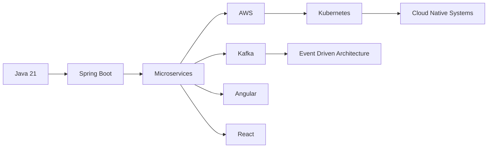

# 👋 Welcome to My Engineering Space

### Senior Full Stack Java Engineer

🚀 Building scalable enterprise platforms using Java, Spring Boot, AWS, Angular, and React

🏢 Currently modernizing enterprise insurance platforms at **Plymouth Rock Assurance**

🔄 Enterprise Modernization • ☁️ Cloud Native Architecture • ⚡ Distributed Systems

---

# 💡 About Me

Senior Full Stack Java Engineer with **7+ years of experience** designing, modernizing, and scaling enterprise applications across:

🏦 Insurance
💳 FinTech
🎮 Gaming
🎓 Education

I specialize in transforming legacy enterprise systems into scalable cloud-native architectures while maintaining reliability, security, and long-term maintainability.

---

# 🏢 Experience Snapshot

| Company                    | Role                             | Timeline       |
| -------------------------- | -------------------------------- | -------------- |
| 🔵 Plymouth Rock Assurance | Senior Full Stack Java Developer | 2025 - Present |
| 🟣 Belhaven University     | Full Stack Java Developer        | 2024 - 2025    |
| 🟠 NE Group                | Java Developer                   | 2018 - 2023    |

---

# 🚀 Current Focus

<table>
<tr>

<td width="50%">

### Enterprise Modernization

* Java 8 → Java 21
* Spring XML → Spring Boot
* Jakarta EE Migration
* JBoss EAP 7 → JBoss EAP 8

</td>

<td width="50%">

### Cloud Native Engineering

* AWS Architecture
* Docker
* Kubernetes
* CI/CD Automation

</td>

</tr>
</table>

---

# ⚡ Technology Stack

## Backend Engineering

## Frontend Engineering

## Cloud & DevOps

## Databases & Messaging

---

# 🏗️ Engineering Expertise

---

# 🎯 Areas of Expertise

🔹 Enterprise Application Modernization

🔹 Distributed Systems Design

🔹 Event Driven Architecture

🔹 Cloud Native Platforms

🔹 API Security & Governance

🔹 Observability & Monitoring

🔹 Performance Optimization

🔹 Scalable Microservices

---

# 🚀 Featured Engineering Initiatives

### Enterprise Platform Modernization

Migrating enterprise applications from Java 8, Spring XML, and JBoss architectures into Java 21 and cloud-native platforms.

### Microservices Architecture Blueprint

Production-grade architecture covering:

* API Gateway
* Service Discovery
* Configuration Management
* Distributed Tracing
* Security
* Monitoring
* Kafka Integration

### API Test Data Management Platform

Centralized platform for API payload management, testing workflows, reusable datasets, and developer productivity.

### Cloud Native Engineering Labs

Reference implementations using:

* AWS
* Docker
* Kubernetes
* CI/CD
* Observability

---

# 📚 Engineering Interests

☁️ Platform Engineering

⚡ Java 21 Adoption

🏗️ System Design at Scale

🔄 Event Streaming Platforms

🚀 Cloud Architecture

🤖 AI for Software Engineering

---

# 🎓 Education

### Master of Science in Information Technology Management

Belhaven University

GPA: 3.91

---

# 📈 GitHub Statistics

---

# 🤝 Let's Connect

💼 LinkedIn: Add Your LinkedIn URL

📧 Email: [sripyati95@gmail.com](mailto:sripyati95@gmail.com)

🐙 GitHub: https://github.com/spyata6

---

## Building Enterprise Software That Scales

### Java 21 • Spring Boot • AWS • Angular • React

*"Transforming Legacy Systems into Cloud-Native Platforms"*

